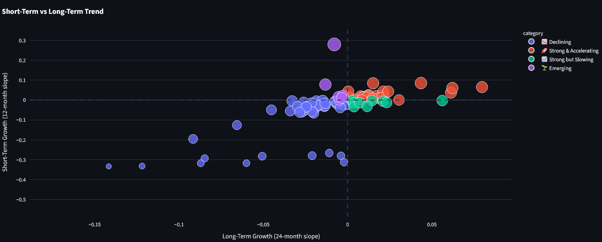
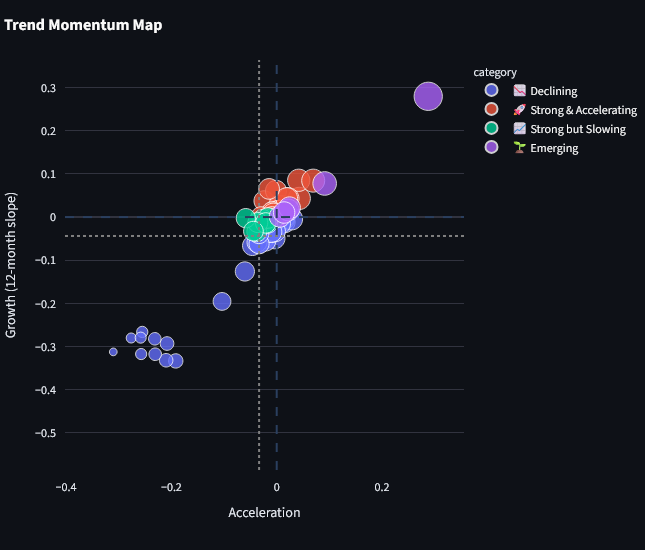
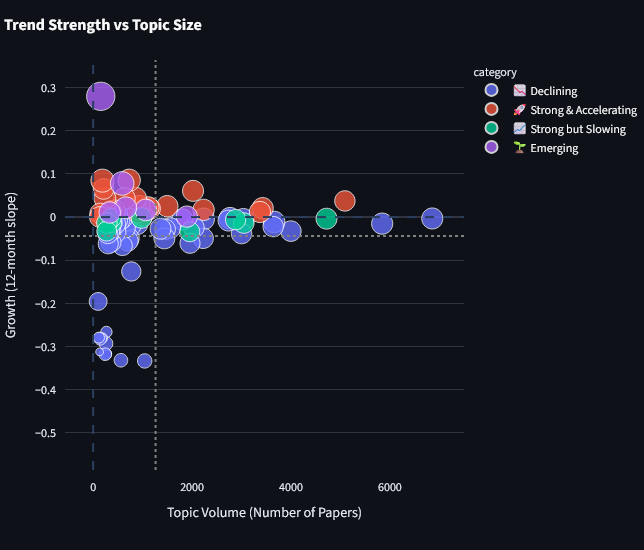

# AI Research Trend Analysis

Discovering emerging AI research topics from arXiv using NLP, topic modeling, and time-series trend analysis.

This project analyzes thousands of AI research papers from arXiv to identify **emerging topics, declining research areas, and high-impact trends** using BERTopic and regression-based trend metrics.

---

# Dashboard Preview

<p align="center">
  
</p>

The interactive Streamlit dashboard allows users to explore research trends and drill down into specific topics.

---

# Project Overview

This project analyzes trends in AI research using arXiv papers and topic modeling.

By combining **NLP, topic modeling, and time-series analysis**, the project identifies:

• Emerging research topics  
• Declining research areas  
• High-impact topics  
• Long-term vs short-term research trends  

Users can explore these insights through an interactive dashboard built with Streamlit.

---

# Dataset

Source: **arXiv API**

Categories analyzed:

- cs.AI (Artificial Intelligence)  
- cs.CL (Computational Linguistics)

Time range:

2018 — Present

Total papers analyzed:

**113,575**

Each record includes:

- Title
- Abstract
- Publication date
- arXiv URL

---

# Project Pipeline

arXiv API
↓
Text preprocessing
↓
Sentence Embeddings
↓
BERTopic Topic Modeling
↓
Topic Reduction
↓
Trend Analysis (Regression)
↓
Interactive Streamlit Dashboard


---

# Methodology

The project pipeline consists of the following steps.

## 1. Data Collection

Papers were collected using the **arXiv API**, including titles, abstracts, publication dates, and URLs.

## 2. Text Embedding

Paper abstracts were converted into **semantic embeddings** using **Sentence Transformers**.

## 3. Topic Modeling

**BERTopic** was used to discover research topics from the corpus.

## 4. Topic Reduction

Topics were reduced to improve interpretability and remove redundant clusters.

## 5. Trend Analysis

Topic prevalence was tracked over time to compute:

• **Growth** (trend slope)  
• **Acceleration** (change in growth)  
• **Topic volume** (paper count)

Regression models were used to quantify research momentum.

## 6. Interactive Dashboard

An interactive **Streamlit dashboard** was built to explore:

- Trend maps
- Topic growth
- Topic acceleration
- Topic deep dives
- Representative papers

---

# Example Visualizations

## Growth vs Acceleration (Trend Momentum Map)

<p align="center">
  
</p>

This map highlights **rapidly emerging research topics** based on their growth rate and acceleration.

---

## Growth vs Volume

<p align="center">
  
</p>

This visualization shows the relationship between **topic popularity and growth dynamics**.

---

# Running the Dashboard

Install dependencies:
```bash
pip install -r requirements.txt
run streamlit run app.py
```

# Repository Structure

├── app.py                  # Streamlit dashboard
├── notebooks/              # Analysis notebooks
├── data/
│   ├── raw/
│   └── processed/
├── images/                 # Dashboard screenshots
├── src/                    # Utility scripts
└── README.md

# Live Dashboard
